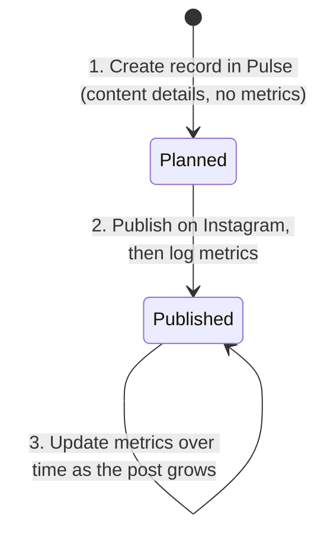
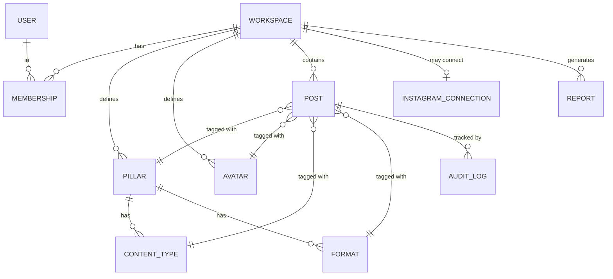
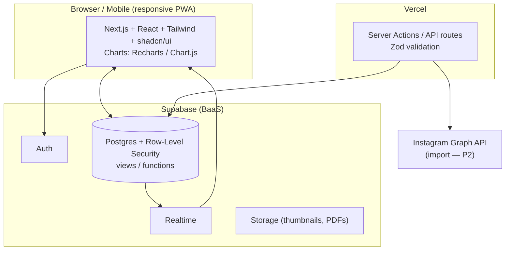

# Product Requirements Document
## Instagram Content Analytics Platform
**Working name:** *Pulse* (placeholder — rename freely)

| | |
|---|---|
| **Owner** | DF Foods — Marketing |
| **Author** | — |
| **Status** | **Final v2.0 — approved for build** |
| **Last updated** | 2026-07-10 |
| **Supersedes** | The current Google Sheet + single-file HTML dashboard |
| **Companion artifacts** | Interactive UI mockup (`app-mockup.html`); working dashboard to be ported (`Dashboard IG/index.html`) |

---

## 0. Table of contents
1. Executive summary
2. Problem statement
3. Goals, non-goals & success metrics
4. Target users & personas
5. Product principles
6. User stories / jobs-to-be-done
7. Scope & phased roadmap
8. Functional requirements
9. The post lifecycle (create → publish → log)
10. Analytics & metric definitions (the "engine")
11. Data model / schema
12. Technical architecture & stack
13. Information architecture & key screens
14. Non-functional requirements
15. Migration plan (off Google Sheets)
16. Risks & mitigations
17. Assumptions & remaining decisions
18. Out of scope (v1)
19. Appendix — taxonomy, formulas & glossary

---

## 1. Executive summary

DF Foods currently tracks Instagram content performance by **manually typing into a Google Sheet**, whose formulas compute scores and leaderboards, which a separate **HTML dashboard** then visualizes. It works but is fragile: it depends on public sharing of the sheet, brittle formulas that sometimes fail to recalculate, no input validation, and two disconnected artifacts.

**Pulse replaces the entire stack with one secure, centralized web app** where a small team **enters** content data and **instantly sees** dashboards, reports, and insights. The spreadsheet is retired.

Four decisions shape this product:
- **Small team (2–5)** with role-based access (Admin / Editor / Viewer).
- **Two ways to add a post:** type metrics **manually**, *or* **import from Instagram** (Graph API) — the user's choice per post.
- **A create-then-log lifecycle:** users create the post record *before* publishing, publish on the platform, then return to log/update performance metrics over time.
- **Computed analytics only** — smart rule-based insights, no AI-written narratives (for now).

The existing dashboard's **visual language and analytics methodology** (weighted percentile scoring, pillar/avatar performance, weekly/monthly rollups, the date-range filter, best-of spotlights) are **preserved and reused** — this is an evolution, not a restart.

---

## 2. Problem statement

**Current flow:** `Manual Entry (Google Sheet)` → `formulas compute analytics` → `HTML dashboard reads the sheet via public gviz endpoint` → `visuals`.

| # | Pain point | Impact |
|---|---|---|
| P1 | Data entry is raw cell-typing with **no validation**. | Dirty data → wrong analytics. |
| P2 | Spreadsheet **formulas are fragile** ("don't edit green cells"); heavy ranking formulas sometimes **don't recalculate**. | Users lose trust. |
| P3 | The dashboard requires the sheet to be **shared publicly**. | Privacy concern. |
| P4 | **Two disconnected artifacts** with sync-only refresh, caching, CORS/gviz quirks. | Confusing, high-maintenance. |
| P5 | Cascading logic (Pillar → Type/Format → Post Type) lives in fragile dropdown formulas. | Taxonomy changes are risky. |
| P6 | No status/lifecycle — a planned post and a live post look identical; **no way to track "published but metrics not yet entered."** | Missed/late data. |
| P7 | No mobile entry, autosave, undo, edit history, or roles. | Slow, error-prone, ungoverned. |
| P8 | No reports or automated insights. | Manual analysis; missed opportunities. |

---

## 3. Goals, non-goals & success metrics

### 3.1 Goals
- **G1 — Retire the Google Sheet.** All content data is entered and stored in the app.
- **G2 — One integrated platform:** enter → auto-process → visualize, in real time.
- **G3 — Fast, guided, validated entry** (manual *or* Instagram import; desktop & mobile), preserving the Pillar→Type/Format→Post-Type cascade and adding a **Planned→Published lifecycle**.
- **G4 — Preserve analytics fidelity:** the exact metric & weighted-scoring methodology carries over and becomes configurable.
- **G5 — Secure & private:** authenticated, role-based access; no public data exposure.
- **G6 — Reports & computed insights:** exportable/shareable reports and automated rule-based insights.
- **G7 — Extensible foundation** for Instagram auto-sync and multi-brand later.

### 3.2 Non-goals (v1)
- **AI-written insights/narratives** (insights are computed/rule-based only for now).
- A **post scheduler / publisher** (Pulse does not publish to Instagram).
- A full **social-media-management suite** (inbox, DMs, ads).
- A **multi-tenant commercial SaaS** (architecture won't preclude it, but it's not a v1 goal).

### 3.3 Success metrics
| Metric | Target |
|---|---|
| Time to create a post record | ≤ 30 seconds |
| Time to log metrics for a published post | ≤ 30 seconds |
| Data-entry errors (invalid/blocked at entry) | ↓ 90% via validation |
| Dashboard freshness after a change | Real-time (< 1s perceived) |
| Google Sheet usage | 0 (retired after migration) |
| Published posts with metrics logged within 48h | ≥ 90% |
| Uptime | ≥ 99.5% |
| Team adoption | 100% of content data entered in-app |

---

## 4. Target users & personas

Small team of **2–5**, with role-based access.

| Persona | Role | Needs |
|---|---|---|
| **Maya — Marketing Manager** (Admin) | Owns analytics, enters most data, manages taxonomy & team, reports to leadership. | Fast entry, trustworthy analytics, monthly reports, "what's working." |
| **Ravi — Content Creator** (Editor) | Creates post records for his content; logs metrics after publishing. | Dead-simple, mobile-friendly entry; can't break global settings. |
| **Priya — Brand Lead** (Viewer) | Reviews dashboards & reports; doesn't enter data. | Read-only dashboards; shareable reports. |

**Roles:** **Admin** (everything, incl. settings/members) · **Editor** (create/edit posts & metrics) · **Viewer** (read-only).

---

## 5. Product principles
1. **The sheet is gone.** One place to enter, one place to see.
2. **Entry is guided, not freeform.** Cascades and validation make bad data hard to create.
3. **Plan first, measure later.** The lifecycle mirrors how content actually works.
4. **Two on-ramps for data.** Manual for control, Instagram import for speed — same record either way.
5. **Faithful to the numbers.** Preserve the existing scoring methodology exactly; make it configurable.
6. **Real-time & private.** Changes reflect instantly; data never leaves the workspace.

---

## 6. User stories / jobs-to-be-done

**Create & publish**
- As Ravi, I **create a post record before publishing** — Date, Title, Caption, Pillar (which narrows Content Type & Format), Format (which auto-sets Reel/Carousel), and Avatar — and save it as **Planned**, with no metrics required yet.
- As Ravi, after I publish on Instagram, I **return and log the metrics** (Views, Likes, Comments, Shares, Saves, Reach) and mark it **Published** — and I can **keep updating** those numbers as the post grows.
- As Maya, I can instead **import a post from Instagram** — it auto-fills metrics and marks the post Published; I just assign Pillar/Avatar.

**Analyze**
- As Maya, I can **filter the whole dashboard by any date range** — presets (Today, Yesterday, Last 7/14/28/30 days, This/Last week, This/Last month, This year, All time) or a **custom From–To** — and every KPI, chart, and table recomputes for that window vs. the preceding period.
- As Maya, I see **KPIs, best reels/carousels (this week / this month / any month), pillar & avatar performance, weekly/monthly trends, and growth** — updating live.
- As Maya, I can **export a monthly report (PDF)** and share a **read-only link**, and I get **computed insights** ("Carousels beat Reels on saves; top pillar is Diabetes").

**Administer**
- As Maya (Admin), I can **manage taxonomy** (pillars, avatars, per-pillar content types & formats, Format→Post-Type map) and **tune scoring weights** without code, and **invite teammates** with roles.

---

## 7. Scope & phased roadmap

> Effort ranges assume one experienced full-stack developer (or an AI-assisted build); planning estimates, not commitments.

| Phase | Theme | Key deliverables | Effort |
|---|---|---|---|
| **P0** | Foundation | This PRD; UX (mockup ✔); DB schema; auth; project scaffold. | ~1 wk |
| **P1 — MVP** | **Replace the sheet** | Auth + workspace + **roles**; **taxonomy management**; **guided manual entry with the Planned→Published lifecycle** (cascade + validation + autosave); **posts data grid** (search/filter/sort incl. **status filter**, bulk, CSV import/export); **analytics engine**; **dashboard with the date-range filter** + spotlights, ported from the existing dashboard; deploy. | ~4–6 wks |
| **P2** | Team, Instagram import & reporting | Teammate **invites**; **Instagram API import** (per post, type *or* auto-fetch); **PDF report export** + shareable read-only links; **computed insights**; weekly email digest; audit log; mobile-optimized entry. | ~4–5 wks |
| **P3** | Intelligence & scale | Anomaly detection & simple forecasting (computed); multi-brand / multi-workspace; benchmark comparisons; deeper/auto Instagram sync; content-calendar view of planned posts. | ~4–6 wks |

**MVP definition of done:** the Google Sheet can be retired — every entry, computation, and visualization it powered now lives in the app, with the create→publish→log workflow, validated entry, the date-range dashboard, and real-time updates.

---

## 8. Functional requirements

Priorities: **M**ust / **S**hould / **C**ould. (Phase in parentheses.)

### 8.1 Authentication & workspace
| ID | Requirement | Pri |
|---|---|---|
| FR-A1 | Email/password + magic-link sign-in; secure sessions. | M |
| FR-A2 | A **Workspace** (brand) scopes all data. | M |
| FR-A3 | Roles: **Admin / Editor / Viewer**, enforced in UI **and** database. | M (P1) |
| FR-A4 | Invite teammates by email; manage members & roles. | S (P2) |

### 8.2 Data entry
| ID | Requirement | Pri |
|---|---|---|
| FR-E0 | **Two ways to add a post (user's choice per post):** (a) **Manual entry**, or (b) **Import from Instagram** (auto-fetch metrics via Graph API). Both create the same record; imports are flagged `source = instagram` and are editable. | M (manual) · S (import, P2) |
| FR-E0b | **Post lifecycle / status:** **Planned** (record created, not yet published, metrics optional) → **Published** (live). Workflow: create record → publish on platform → return and enter/update metrics. Metric inputs are hidden until Published; planned posts surface an "add metrics" prompt. | M |
| FR-E1 | Post fields: **Date, Title, Caption, Content Pillar, Content Type, Format, Post Type (auto), Audience Avatar, Status**, and — after publishing — **Views, Likes, Comments, Shares, Saves, Accounts Reached** (updatable anytime). | M |
| FR-E2 | **Cascading fields:** Pillar filters Content Type & Format; Format auto-sets Post Type (Reel/Carousel). | M |
| FR-E3 | **Validation:** required fields; numeric, non-negative metrics; valid date; soft warnings (e.g., reach < total engagement). | M |
| FR-E4 | **Autosave / drafts**; explicit save; clear success/error feedback. | S |
| FR-E5 | Edit, **duplicate**, delete; confirm destructive actions; **undo** where feasible. | M |
| FR-E6 | **Quick-add** (keyboard-friendly) and **mobile-optimized** entry. | S |
| FR-E7 | **CSV import** with column mapping + validation preview (migration & bulk entry). | M |
| FR-E8 | Optional fields: permalink/URL, thumbnail image, notes/tags. | C |

### 8.3 Data management
| ID | Requirement | Pri |
|---|---|---|
| FR-D1 | **Posts grid:** paginated, searchable, filterable (by **status**, pillar, avatar, format, post type, date range), sortable. | M |
| FR-D2 | **Status column** with clear badges (🕓 Planned / ✅ Published) and an inline "add metrics" action for planned posts. | M |
| FR-D3 | Inline edit; **bulk edit / delete**. | S |
| FR-D4 | **CSV/Excel export** of raw posts and computed tables. | M |
| FR-D5 | Empty / loading / error states throughout. | M |

### 8.4 Analytics engine (see §10)
| ID | Requirement | Pri |
|---|---|---|
| FR-N1 | Compute **KPIs** (posts, reels, carousels, views, reach, likes, comments, shares, saves, engagement rate). | M |
| FR-N2 | Compute **per-post weighted percentile score** (format-specific weights, within period). | M |
| FR-N3 | **Pillar & Avatar performance** incl. average score. | M |
| FR-N4 | **Weekly & monthly rollups**; **period-over-period growth** (selected range vs. preceding equal-length window). | M |
| FR-N5 | **Best Reel / Best Carousel** — this week, this month, any month; all-time Top 20. | M |
| FR-N6 | Recompute **in real time** on any data change. | M |
| FR-N7 | **Configurable scoring weights & taxonomy** drive the engine (no hard-coding). | S |
| FR-N8 | Analytics count **Published posts**; planned posts are excluded until metrics exist. | M |

### 8.5 Dashboards & visualization
| ID | Requirement | Pri |
|---|---|---|
| FR-V1 | Overview: KPI cards + trend + content mix + views by pillar/avatar. | M |
| FR-V2 | **Global date-range filter** — presets (Today, Yesterday, Last 7/14/28/30 days, This/Last week, This/Last month, This year, All time) **+ custom From–To** — re-slicing the whole dashboard; trend auto-buckets by day/week/month. | M |
| FR-V3 | Best Reels & Best Carousels with **This Week / This Month / pick-a-month spotlight**, Top-by-score chart, Top 20 table. | M |
| FR-V4 | Content Pillars & Audience Avatars (views + avg-score charts, sortable breakdown). | M |
| FR-V5 | Growth (selected period vs. previous, growth %, pillar/avatar shift, winners). | M |
| FR-V6 | Weekly trend (views/engagement/posts/reach). | M |
| FR-V7 | Interactive, responsive charts; light/dark. | M |
| FR-V8 | **Drill-down** from a chart segment to underlying posts. | C |

### 8.6 Reports & insights
| ID | Requirement | Pri |
|---|---|---|
| FR-R1 | **Export monthly report to PDF** (branded). | S (P2) |
| FR-R2 | **Shareable read-only report link** (tokenized, revocable). | S (P2) |
| FR-R3 | **Computed / rule-based insights** (best/worst pillar, format that drives saves, growth callouts, under-served avatar, "N planned posts awaiting metrics"). | S (P2) |
| FR-R4 | **Scheduled email digest** (weekly/monthly). | C |
| FR-R5 | ~~AI-written insights~~ — **explicitly out of scope** for v1 (computed only). May be revisited later. | — |

### 8.7 Settings & taxonomy
| ID | Requirement | Pri |
|---|---|---|
| FR-S1 | Manage **Pillars, Avatars, Content Types (per pillar), Formats (per pillar) & Format→Post-Type mapping**. | M |
| FR-S2 | Configure **scoring weights** per format type; toggle metrics. | S |
| FR-S3 | Brand profile (name, logo, colors) applied to app & reports. | C |
| FR-S4 | **Unbounded** capacity (no 500-post / 60-week caps like the sheet). | M |

### 8.8 Instagram import & automation
| ID | Requirement | Pri |
|---|---|---|
| FR-I1 | **Connect an Instagram account** to a workspace via OAuth (Graph API / Meta app). | S (P2) |
| FR-I2 | **Import a post** — pick a recent post (or paste its link) → auto-fill Views, Likes, Comments, Shares, Saves, Reach, date, caption, thumbnail; user assigns Pillar/Type/Format/Avatar; post is marked **Published**. | S (P2) |
| FR-I3 | **Bulk / scheduled sync**; reconcile imported vs manual data; flag discrepancies. | C (P3) |
| FR-I4 | **Manual entry always available** as the fallback — no hard dependency on API availability/Meta approval. | M |

### 8.9 Notifications (P2+)
| ID | Requirement | Pri |
|---|---|---|
| FR-NT1 | Reminders for **planned posts awaiting metrics** after N days. | S |
| FR-NT2 | Weekly performance digest email. | C |

---

## 9. The post lifecycle (create → publish → log)

- **Planned** — created before publishing. Requires only content details (Date, Title, Pillar, Type, Format, Avatar). Metric inputs hidden; appears in the grid with a 🕓 Planned badge and an **"Add metrics"** action. Excluded from performance analytics.
- **Published** — the post is live and has metrics. Reached via manual "Add metrics", editing the status, or an Instagram import (which lands directly here). Metrics are **updatable indefinitely** (`metrics_updated_at` tracks freshness).

---

## 10. Analytics & metric definitions (the "engine")

> Preserves the current methodology exactly; all values are **configurable defaults**.

### 10.1 Per-post metrics
- **Views, Likes, Comments, Shares, Saves, Accounts Reached** — entered/imported.
- **Like/Comment/Share/Save rate** = metric ÷ Accounts Reached.
- **Total engagement** = Likes + Comments + Shares + Saves.

### 10.2 KPIs (aggregate over a scope)
- Totals for posts, reels, carousels, views, reach, likes, comments, shares, saves.
- **Engagement Rate** = (Likes + Comments + Shares + Saves) ÷ Accounts Reached.

### 10.3 Weighted performance score (per post, 0–1)
Each of 5 metrics → **percentile rank** vs. similar posts of the same format in the same period → weighted:

| Metric | Reel weight | Carousel weight |
|---|---|---|
| Views | 20% | 10% |
| Like rate | 15% | 10% |
| Comment rate | 25% | 20% |
| Share rate | 25% | 30% |
| Save rate | 15% | 30% |

*(Carousels weight Shares & Saves higher — the strongest quality signal for reference content.)*

### 10.4 Rollups & rankings
- **Pillar / Avatar performance** = posts, views, likes, comments, shares, **avg score**.
- **Best Reel / Best Carousel** for This Week, This Month, any month; **all-time Top 20**.
- **Weekly rollup** (Mon–Sun): views, engagement, posts, reach.
- **Period comparison:** selected date range vs. the **preceding equal-length window**; **Growth %** = (current − previous) ÷ previous.
- **Best pillar/avatar per period** = highest avg score.

### 10.5 Date-range & real-time behavior
- **Any date range** (preset or custom) filters all analytics; the trend chart **auto-buckets** by day (≤ ~31d), week (≤ ~30 weeks), or month.
- Any create/edit/delete recomputes affected aggregates immediately (client-side compute for interactive slices; SQL views/functions for shared, heavy rollups — see §12).

---

## 11. Data model / schema

| Entity | Key fields |
|---|---|
| **workspace** | id, name, logo_url, brand_colors, created_at |
| **user** | id, email, name, created_at |
| **membership** | id, workspace_id, user_id, role (admin/editor/viewer) |
| **pillar** | id, workspace_id, name, sort_order, active |
| **avatar** | id, workspace_id, name, sort_order, active |
| **content_type** | id, workspace_id, pillar_id, name, active |
| **format** | id, workspace_id, pillar_id, name, post_type (reel/carousel), active |
| **post** | id, workspace_id, date, title, caption, pillar_id, content_type_id, format_id, avatar_id, post_type, **status (planned/published), published_at**, views, likes, comments, shares, saves, reach, **metrics_updated_at**, permalink, thumbnail_url, **source (manual/instagram), instagram_media_id**, created_by, created_at, updated_at |
| **instagram_connection** | id, workspace_id, ig_account_id, ig_username, access_token (encrypted), connected_by, expires_at |
| **scoring_config** | id, workspace_id, post_type, weights (json) |
| **report** | id, workspace_id, type, period, share_token, created_at |
| **audit_log** | id, workspace_id, entity, entity_id, action, actor_id, diff (json), created_at |

**Notes:** Post Type and Status are stored for query speed but derived/managed (Post Type from Format; Status from the lifecycle). Aggregates (KPIs, tables, scores) are **computed**, not stored as source-of-truth — via Postgres views/functions (`percent_rank()` partitioned by period + format) plus lightweight client-side compute for interactive filtering.

---

## 12. Technical architecture & stack

**Recommended stack — Next.js + Supabase + Vercel:**
- **Next.js + React + Tailwind + shadcn/ui + Recharts/Chart.js** — fast to build, componentized; **ports the existing dashboard's charts and metric logic** directly.
- **Supabase** — Postgres + **Auth + Row-Level Security + Realtime + Storage**. RLS enforces per-workspace privacy at the DB layer; Realtime powers live updates. Ideal for a small team; generous free tier.
- **Vercel** — zero-config hosting & previews.
- **Zod + react-hook-form** (typed validation), **TanStack Table** (data grid).
- **Instagram Graph API** for import (P2).
- **No third-party AI** in v1 (insights are computed).

**Alternatives considered:** low-code (Airtable/Retool) — fastest but limited custom analytics/branding and per-seat cost; fully custom Node/Nest — max control, more infra; client-only/IndexedDB — rejected (not centralized, no multi-user). **Verdict: Next.js + Supabase + Vercel** best satisfies "centralized, real-time, secure, small-team" at lowest cost, and reuses existing work.

**Reuse from today:** metric & scoring logic, chart components, KPI cards, date-range filter, best-of spotlight, and the taxonomy (all documented in §19) port directly.

---

## 13. Information architecture & key screens

**Nav:** `Dashboard` · `Insights` · `Reports` · `Add Post` · `Posts` · `Settings`.
A clickable prototype exists — see `app-mockup.html` (sidebar shell, guided manual/Instagram entry, status lifecycle, posts grid, dashboard, insights, settings).

| Screen | Purpose | Notes |
|---|---|---|
| **Dashboard** | All analytics tabs + the **date-range filter**. | Ports the current dashboard; live-updating. |
| **Add / Edit Post** | Guided entry (manual **or** Instagram import) with cascade, validation, autosave, and the **Planned/Published status** toggle (metrics appear once Published). | Modal for quick-add, full page for mobile. |
| **Posts** | The data grid (search / status & attribute filters / sort / bulk / import / export). Planned posts show an **"add metrics"** action. | Replaces the Manual Entry sheet. |
| **Insights** | Computed insight feed. | Rule-based (no AI). |
| **Reports** | Generate / export (PDF) / share reports. | P2. |
| **Settings** | Taxonomy, scoring weights, members/roles, brand. | Admin-gated global config. |

---

## 14. Non-functional requirements
| Area | Requirement |
|---|---|
| **Performance** | Dashboard interactive < 2s on thousands of posts; entry save < 500ms perceived (optimistic UI). |
| **Real-time** | New/edited data reflects within ~1s (Supabase Realtime / optimistic updates). |
| **Security & privacy** | Auth required; **Row-Level Security** per workspace; secrets server-side; encrypted Instagram tokens; HTTPS everywhere; no public data exposure. |
| **Scalability** | 10k+ posts and multiple workspaces without redesign. |
| **Availability** | ≥ 99.5%; managed hosting; automated DB backups. |
| **Data integrity** | Transactional writes; validation at form **and** DB (constraints); audit log; soft-delete + undo. |
| **Accessibility** | WCAG 2.1 AA. |
| **Responsive** | Full functionality on mobile (esp. entry) & desktop; installable PWA (C). |
| **Browsers** | Latest Chrome, Safari, Firefox, Edge. |
| **Observability** | Error tracking (e.g., Sentry) + basic product analytics. |

---

## 15. Migration plan (off Google Sheets)
1. **Export** the current `Manual Entry` tab to CSV.
2. **Seed taxonomy** from the current Pillars/Avatars/Content-Types/Formats/Format→Post-Type map (§19).
3. **CSV import** with column mapping → validate → preview → commit. Imported historical posts default to **Published** (they have metrics).
4. **Verify parity:** confirm KPIs, pillar/avatar tables, and Top-20 match the old dashboard for the same data.
5. **Parallel run** briefly, then **retire the sheet** and revoke its public share.

*(Data-hygiene note from the dashboard work: some historical dated posts lack titles, and titles sometimes sit on separate untitled rows — the import mapping should surface and resolve these.)*

---

## 16. Risks & mitigations
| Risk | Likelihood | Mitigation |
|---|---|---|
| Analytics don't match the old sheet | Med | Port formulas exactly; parity test during migration. |
| Scope creep (AI, IG sync pulled into MVP) | High | Phase gates; MVP = "replace the sheet + lifecycle + date-range dashboard" only. |
| Instagram API limits / Meta app approval | Med | Manual entry is always the baseline; import is an accelerator (P2). |
| Planned posts never get metrics | Med | "Awaiting metrics" badges, filters, and reminder notifications. |
| Cost creep | Low | Free tiers; small data volume; monitor. |
| Data loss / bus factor | Med | Automated backups; export anytime; audit log. |
| Adoption friction | Med | Entry faster than the sheet (cascade, autosave, mobile, import, lifecycle). |

---

## 17. Assumptions & remaining decisions

**Confirmed**
- Small team (2–5) with role-based access.
- **Dual data entry**: manual **or** Instagram import (import targeted for P2; manual is the MVP baseline).
- **Create → publish → log** lifecycle (Planned → Published).
- **Computed insights only** (no AI writing) for v1.
- Cloud hosting (Vercel + Supabase); reuse of the current taxonomy & scoring as defaults.

**Remaining decisions**
1. **Budget / hosting** — free-tier only, or is a small monthly cost acceptable? *(Recommend starting on Vercel + Supabase free tiers.)*
2. **Timeline** — target date to retire the sheet (MVP)?
3. **Product name & branding** — keep "Pulse" placeholder, or a specific name/logo?
4. **Instagram scope** — is a **planned/scheduled date** field (distinct from publish date) and a **content-calendar** view wanted in P2, or later?

---

## 18. Out of scope (v1)
AI-written insights; post scheduling/publishing; ad analytics; competitor benchmarking; multi-platform (TikTok/YouTube). Candidates for a later roadmap once the Instagram workflow is solid.

---

## 19. Appendix — taxonomy, formulas & glossary

**Content Pillars (5):** Diabetes · Obesity · Kids · Nutrition Myths · Longevity

**Audience Avatars (7):** Diabetes Patient · Parents · Working Professional · Senior Adult · Health Enthusiast · Weight Loss · Womens

**Per-post fields:** Date · Title · Caption · Content Pillar · Content Type · Format · Post Type (auto) · Audience Avatar · **Status** · Views · Likes · Comments · Shares · Saves · Accounts Reached

**Cascades:** Content Pillar → filters **Content Type** and **Format** (pillar-specific lists) → **Format** determines **Post Type** (Reel/Carousel).

**Engagement Rate** = (Likes + Comments + Shares + Saves) ÷ Accounts Reached.
**Rates** = metric ÷ Accounts Reached. **Growth %** = (current − previous) ÷ previous (previous = preceding equal-length window).
**Weighted score:** percentile-rank each metric within period, weight — Reels **20/15/25/25/15**, Carousels **10/10/20/30/30** (Views / Like-rate / Comment-rate / Share-rate / Save-rate).

**Status:** *Planned* (created, pre-publish, no metrics) → *Published* (live, metrics logged & updatable).

**Retired constraints:** the sheet's 500-post / 60-week / 30-month caps do **not** carry over — Pulse is unbounded.

---

*End of PRD v2.0 (Final). Recommended next step: resolve §17 remaining decisions, then produce the P0 technical design (schema + RLS policies + migration scripts) and begin the MVP build.*
